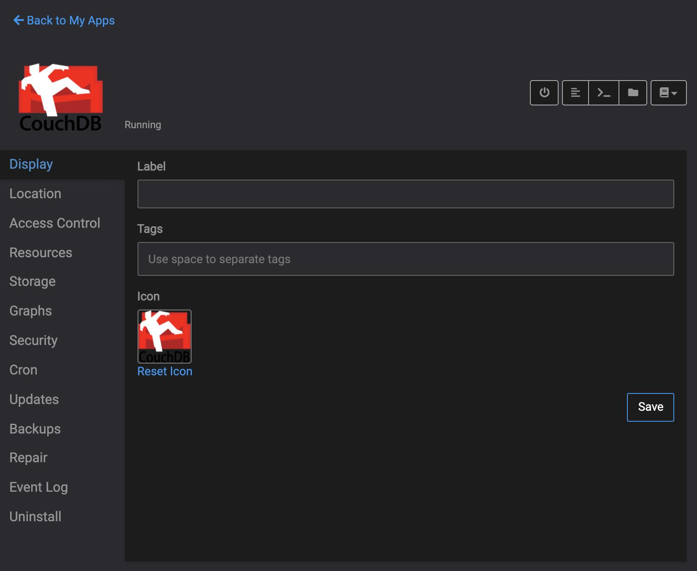
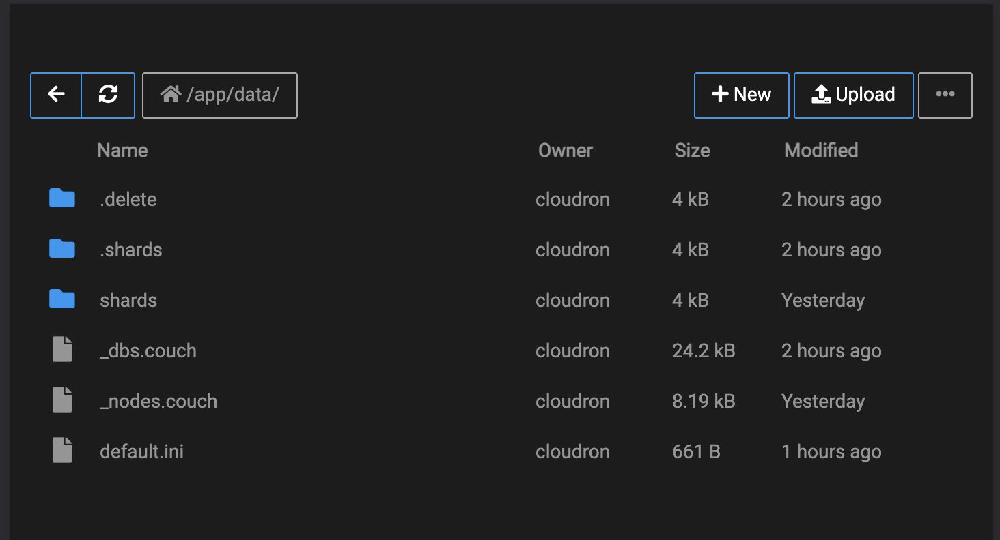

# CouchDB Cloudron README
CouchDB 3.2.1 - Licensed under the Apache License 2.0 Apache CouchDB, CouchDB, and the project logo are trademarks of The Apache Software Foundation

CouchDB Cloudron docker app ready to deploy.
Available also as docker-image ready for Cloudron deploy from docker-hub: [Docker Hub Image](https://hub.docker.com/r/terapolis/cloudron-couchdb)

- Cloudron `proxyAuth` authentication layer on path `/_utils` for extendeed security
- CouchDB configuration on `default.ini` file available on cloudron file manager under `app/data` folder
- Ready for CORS on `localhost` and `localhost:4200`


### IMPORTANT! ADMINISTRATION PASSWORD
IMPORTANT! Change `administrator=password123` from default.ini file. Password will be auto-encrypted on first run.

## Build dockerfile image (example)

To build dockerfile image from source files run:
```
docker build -t example-dockerhub-user/cloudron-couchdb .
```

To push docker image into docker-hub from source files run:
```
docker push example-dockerhub-user/cloudron-couchdb
```
## Install on Cloudron from Docker-Hub with Cloudron CLI
To install docker image into cloudron from docker-hub run:
 ```
cloudron install --image example-dockerhub-user/cloudron-couchdb
```



